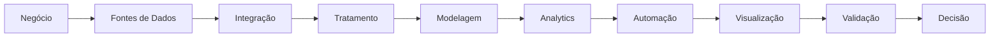

<div align="center">

# Glaydson Moreira

### Senior Data Analyst · Business Intelligence · Data Engineering · Software Development

**Dados · Analytics · Automação · Engenharia · Tecnologia**

Desenvolvendo soluções que conectam **dados, tecnologia e negócio** para transformar informações complexas em decisões, processos e produtos digitais.

<br>

[](SEU_LINK_DO_LINKEDIN)
[](https://github.com/glaydson-moreira)

</div>

---

## Professional Profile

Profissional Sênior de Dados e Tecnologia com experiência na construção de soluções analíticas, automações e aplicações orientadas a dados.

Minha atuação combina **Business Intelligence, Data Analytics, Engenharia de Dados e Desenvolvimento de Software**, acompanhando o ciclo completo da informação: entendimento do problema, integração das fontes, transformação dos dados, modelagem, desenvolvimento de métricas, visualização, automação, validação e evolução da solução.

Mais do que desenvolver dashboards, busco construir **produtos de dados confiáveis, escaláveis, documentados e sustentáveis**, conectando tecnologia às necessidades reais do negócio.

```text
Business Understanding
        ↓
Data Integration
        ↓
Data Engineering
        ↓
Analytics & Modeling
        ↓
Software & Automation
        ↓
Visualization
        ↓
Validation & Governance
        ↓
Decision Support
```

---

## Strategic Focus

### RSAC — Risco Socioambiental e Climático

Atualmente atuando no desenvolvimento de solução relacionada a **Risco Socioambiental e Climático (RSAC)**, envolvendo tratamento, integração e análise de dados para construção de produtos analíticos voltados ao acompanhamento e à tomada de decisão.

O projeto envolve atividades relacionadas a:

* integração e tratamento de diferentes fontes de dados;
* preparação e transformação de dados;
* regras de negócio e qualidade da informação;
* consultas e manipulação de dados;
* desenvolvimento de soluções analíticas;
* automação de processos;
* visualização e exploração de informações;
* organização e documentação técnica da solução;
* evolução da arquitetura do projeto.

**Principais tecnologias e conceitos envolvidos:**

`Python` · `SQL` · `Power BI` · `Power Query` · `DAX` · `SharePoint` · `ETL/ELT` · `Data Modeling` · `Automation`

---

### SMI Nº 2026/008

Minha atuação profissional também está direcionada às competências relacionadas à:

**Solicitação de Manifestação de Interesse (SMI) nº 2026/008 — Consultor Individual Especialista em Monitoramento, Avaliação, Conformidade e Reporte.**

Esse direcionamento reúne áreas que fazem parte da minha trajetória profissional:

* monitoramento de informações e indicadores;
* análise e avaliação de dados;
* organização e rastreabilidade da informação;
* produção de informações gerenciais;
* consolidação de diferentes fontes;
* automação e melhoria de processos;
* documentação;
* reporte executivo;
* suporte à tomada de decisão;
* desenvolvimento de soluções de dados para ambientes corporativos.

---

## Technology Stack

### Data Analytics & Business Intelligence


**Competências**

`Data Analytics` · `KPIs` · `Dashboards` · `Data Visualization` · `Storytelling` · `Modelagem Analítica` · `Indicadores`

---

### Data & Databases


**Competências**

`Python` · `SQL` · `PostgreSQL` · `Pandas` · `ETL` · `ELT` · `Data Cleaning` · `Data Transformation` · `Data Modeling`

---

### Software Development


Desenvolvendo e aprofundando conhecimentos em:

`JavaScript` · `TypeScript` · `Node.js` · `NestJS` · `React` · `APIs REST` · `Backend Development` · `Frontend Development`

---

### Automation & Integration


`Automação` · `APIs` · `Integrações` · `Processamento de Dados` · `Scripts` · `Workflows`

---

### Engineering & DevOps


`Git` · `GitHub` · `Docker` · `Versionamento` · `Documentação` · `Organização de Projetos`

---

### Design & Data Experience


`Figma` · `UI/UX` · `Dashboard Design` · `Data Visualization` · `Design Systems`

---

## Selected Projects

### 🌱 RSAC — Risco Socioambiental e Climático

> **Data · Analytics · Automation · Business Intelligence**

Projeto voltado à estruturação, tratamento e análise de informações relacionadas ao risco socioambiental e climático.

Atuação envolvendo integração de dados, transformação, regras de negócio, desenvolvimento analítico, automação e organização da arquitetura da solução.

**Stack**

`Python` `SQL` `Power BI` `Power Query` `DAX` `SharePoint`

---

### 📊 PPA — Plano Plurianual

> **Business Intelligence · Data Modeling · Analytics**

Desenvolvimento integral de solução de Business Intelligence para acompanhamento e análise de informações do Plano Plurianual.

Atuação desde o entendimento da necessidade até modelagem, construção das regras analíticas, desenvolvimento das visualizações e entrega da solução.

**Stack**

`Power BI` `DAX` `Power Query` `SQL` `Data Modeling`

---

### 🧩 NorteAgenda & NorteBackend

> **Software Engineering · Backend · APIs · Data**

Ecossistema de aplicações desenvolvido para gerenciamento e agendamento de empresas, composto por aplicação web, aplicação mobile e backend centralizado.

O projeto amplia minha atuação para além da análise de dados, trabalhando conceitos de arquitetura de software, APIs, autenticação, banco de dados e integração entre sistemas.

**Stack**

`TypeScript` `Node.js` `NestJS` `React` `PostgreSQL` `REST APIs` `Docker` `Git`

---

### 🔧 Jira Sustentação

> **Analytics · Maintenance · Evolution**

Atuação na manutenção e evolução de solução analítica utilizada no acompanhamento de demandas de sustentação.

O trabalho atual envolve manutenção da solução existente e preparação de uma nova evolução com melhorias de estrutura, experiência e identidade visual.

**Stack**

`Power BI` `Power Query` `SQL` `SharePoint`

---

## Areas of Expertise

| Área                      | Atuação                                                |
| ------------------------- | ------------------------------------------------------ |
| **Data Analytics**        | Análise, exploração, indicadores e geração de insights |
| **Business Intelligence** | Modelagem, métricas, dashboards e soluções executivas  |
| **Data Engineering**      | Integração, ETL/ELT, tratamento e transformação        |
| **Python**                | Processamento de dados, scripts e automações           |
| **SQL**                   | Consultas, transformação e preparação de dados         |
| **Software Development**  | Backend, frontend, APIs e aplicações                   |
| **Automation**            | Automação de processos e integração de sistemas        |
| **UI/UX**                 | Experiência aplicada a dashboards e produtos digitais  |
| **Documentation**         | Estruturação e documentação técnica de projetos        |

---

## How I Build Data Solutions



Minha abordagem busca conectar três dimensões:

### Business

Entender o problema antes de escolher a tecnologia.

### Data

Garantir qualidade, rastreabilidade, estrutura e significado para a informação.

### Technology

Utilizar engenharia, automação e desenvolvimento para construir soluções sustentáveis.

---

## Engineering Principles

> **Data is only valuable when it can be trusted, understood and used.**

* Dados confiáveis antes de visualizações
* Entendimento do negócio antes da implementação
* Simplicidade antes da complexidade
* Automação de atividades repetitivas
* Código e regras de negócio documentados
* Versionamento e rastreabilidade
* Soluções orientadas à manutenção
* Experiência do usuário também faz parte do produto de dados
* Tecnologia como meio para geração de valor

---

## GitHub Activity

<div align="center">


</div>

<br>

<div align="center">


</div>

---

## Currently Evolving

Meu desenvolvimento técnico atualmente está concentrado na evolução entre **Dados e Engenharia de Software**.

```text
Data Analytics
     │
     ├── Business Intelligence
     │
     ├── Data Engineering
     │
     ├── Python & Automation
     │
     ├── APIs & Integrations
     │
     ├── Backend Engineering
     │
     ├── Software Architecture
     │
     └── Artificial Intelligence
```

Áreas em aprofundamento contínuo:

`Python` · `Analytics Engineering` · `TypeScript` · `Node.js` · `NestJS` · `React` · `APIs` · `Docker` · `Arquitetura de Software` · `IA aplicada a Dados`

---

## Let's Connect

Aberto a conexões e discussões sobre:

**Data Analytics · Business Intelligence · Data Engineering · Python · Automation · Software Engineering · Artificial Intelligence**

<div align="center">

[](SEU_LINK_DO_LINKEDIN)
[](https://github.com/glaydson-moreira)

<br>

### Building reliable data solutions for better decisions.

**Data · Engineering · Analytics · Technology**

</div>
